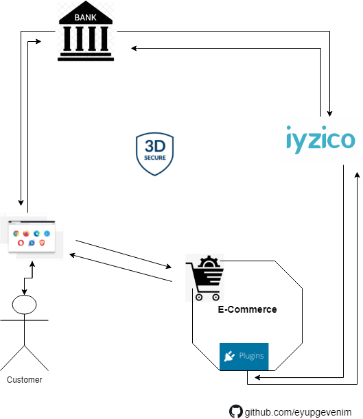

# nopCommerce Iyzico 3D Secure / Sanal POS plugin
   
 Desteklediği Versiyonlar / Supported Versions : 
[4.50](https://github.com/eyupgevenim/Nop.Plugin.Payments.Iyzico/tree/nopCommerce-4.50),
[4.40](https://github.com/eyupgevenim/Nop.Plugin.Payments.Iyzico/tree/nopCommerce-4.40), 
<b>[4.30](https://github.com/eyupgevenim/Nop.Plugin.Payments.Iyzico/tree/nopCommerce-4.30)</b>, 
[4.20](https://github.com/eyupgevenim/Nop.Plugin.Payments.Iyzico/tree/nopCommerce-4.20)

 

    

 
 

Türkçe
======

## Açıklama 📢

İyzico Sanal POS entegrasyonu %100  açık kaynaklı ve ücretsiz &#128519; olduğu gibi projenize dahil edebilir ve üzerine geliştirmeler yapabilirsiniz.
Bu eklentiyi daha iyi hala getirmek için öneri ve pull request'lerinize açıktır.

## Özellikler ✔️✔️

- **3D Güvenlikli Ödeme ✔️**

   Tek çekim, taksitli ve tek tıkla ödeme işlemleri için uygundur. 
   İşleme gönderilen kartın bakiyesinden ilgili miktarı çekme işlemi yapar. 
   Bu servis ile ilgili detaylı bilgiyi [3D ile Ödeme](https://dev.iyzipay.com/tr/api/3d-ile-odeme) sayfasından edinebilirsiniz.
    
- **Standart Ödeme ✔️**

    Tek çekim, taksitli, tek tıkla ödeme ve abonelik işlemleri için kullanılabilir. 
    İşleme gönderilen kartın bakiyesinden ilgili miktarı çekme işlemi yapılır. 
    Bu servis ile ilgili detaylı bilgiyi [Ödeme](https://dev.iyzipay.com/tr/api/odeme) sayfasından edinebilirsiniz.

- **İade ✔️**

   Bankalar gün sonu aldıktan sonra işlemin kısmi veya tam olarak iade edilmesidir. 
   Bu servis ile ilgili detaylı bilgiyi [İade](https://dev.iyzipay.com/tr/api/iade) sayfasından edinebilirsiniz.

- **Taksit ve Bin Sorgulama ✔️**

    Bu servisi kullanarak işleme gönderilecek kartın ilk 6 hanesinden, işlem yapılmak istenen kart ile ilgili bilgi edinebilir ve ek olarak taksit oranlarını yanıt olarak alabilirsiniz. 
    Bu servis ile ilgili detaylı bilgiyi [Taksit ve Bin Sorgulama](https://dev.iyzipay.com/tr/api/taksit-sorgulama) sayfamızdan edinebilirsiniz.

## Kurulum Talimatları 🔥

1. Eklenti arşivini indirin.
2. Yönetici alanı > Yapılandırma > Yerel eklentiler'e gidin.
3. Eklenti arşivini "Eklentiyi veya temayı yükle" eklentisini kullanarak yükleyin.
4. Yeni yüklenen eklentiyi bulmak için eklentiler listesinde aşağı kaydırın. Ve eklentiyi kurmak için "Yükle" düğmesine tıklayın.
5. İyzico api bilgilerinizi ve yapılandırma tercihlerinizi belirleyin. [Eklenti linki](https://www.nopcommerce.com/tr/iyzico-3d-secure-sanal-pos)

Eklentilerin nasıl kurulacağı hakkında daha fazla bilgiyi [burada](https://docs.nopcommerce.com/user-guide/configuring/system/plugins.html) bulabilirsiniz.

## Kaynaklar 🔗
- [nopcommerce.com](https://www.nopcommerce.com/tr)
- [nopCommerce github](https://github.com/nopSolutions/nopCommerce)
- [iyzico.com](https://www.iyzico.com/)
- [iyzico Entegrasyonuna Başlarken](https://dev.iyzipay.com/tr)
- [iyzico API Entegrasyonu](https://dev.iyzipay.com/tr/api)
- [iyzipay-dotnet github](https://github.com/iyzico/iyzipay-dotnet)

 
 

English
=======

## Description 📢

Iyzico Virtual POS integration is 100% open source and free &#128519; 
You can include it in your project and you can develop and pull request too

## Features ✔️✔️

- **3D Secure Pay ✔️** 

    To charge a credit or debit card via 3D Secure you can use a 3D Auth request. 
    You can find more information on the [3D Auth](https://dev.iyzipay.com/en/api/auth-with-3d) page.

- **Standart Pay ✔️**
    
    To charge a credit or debit card you can use an Auth request. 
    Please refer to the [Auth](hhttps://dev.iyzipay.com/en/api/auth) page for details.

- **Refund ✔️**

    This service allows you to refund a charge that has been created previously and was refunded in part only or wasn't refunded at all. 
    You can find more information on the [Refund](https://dev.iyzipay.com/en/api/refund) page.
	
- **Installment ✔️**
- 
    This service returns information about installment options and card. 
    Please head to the [Installment](https://dev.iyzipay.com/en/api/installment-service) page to learn more.

## Installation instructions🔥

1. Download the plugin archive.
1. Go to admin area > configuration > local plugins.
1. Upload the plugin archive using the "Upload plugin or theme" plugin.
1. Scroll down through the list of plugins to find the newly installed plugin. And click on the "Install" button to install the plugin.
1. Register with the Iyzico with [this link](https://www.nopcommerce.com/en/iyzico-3d-secure-sanal-pos)

Please find more information about how to install plugins [here](https://docs.nopcommerce.com/user-guide/configuring/system/plugins.html).

## Resources 🔗
- [nopcommerce.com](https://www.nopcommerce.com/en)
- [nopCommerce github](https://github.com/nopSolutions/nopCommerce)
- [iyzico.com](https://www.iyzico.com/)
- [Getting started](https://dev.iyzipay.com/en)
- [iyzico API Integration](https://dev.iyzipay.com/en/api)
- [iyzipay-dotnet github](https://github.com/iyzico/iyzipay-dotnet)

